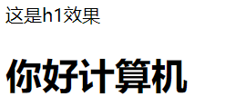
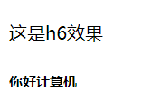
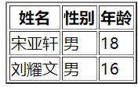
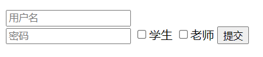
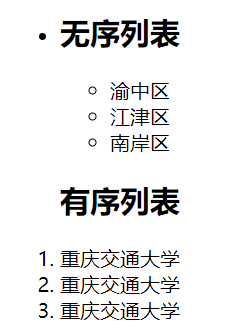
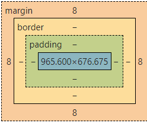

# HTML&CSS 学习总结
## >HTML文档结构

1.\<!DOCTYPE html>:声明文档类型。 
2.\<html></html>: <html>元素。包含整个完整的页面。其他元素都写在里面 
3.\<head></head>: <head>元素。 这个元素是一个容器，它包含了所有你想包含在HTML页面中但不想在HTML页面中显示的内容。可以用来写css和JavaScript 
4.\<meta charset="utf-8">: 这个元素设置文档使用utf-8字符集编码。 
5.\<link rel="shortcut icon" href="favicon.ico" type="image/x-icon">: 指定页面的图标，出现在浏览器标签上。一般用来连接单独的css文件 
6.\<title></title>: 设置页面标题，出现在浏览器标签上。 
7.\<body></body>: <body>元素。 包含你能在页面看到的所有内容，包括文本，图片，音频，游戏等等。

## >标题
1.标题包括h1~h6，h1即最大的标题，h6即最小的标题

## >div布局及标签
div>是一个块级元素，可以把文字、图像、影音等全放在div中。也可以放链接，形成表格等。 
1.链接
<a href="https://cqjtu.edu.cn/" target="_blank">点击一下进入重庆交通大学官网</a>

2.表格和表单

border>定义表格，tr定义表格行，th定义元素表头，td定义元素表格单元

表单用于收集用户的输入信息，通过input设置框，type为text时输入文本，为password时输入密码并且显示为*为submit为提交按钮，为checkbox为复选框

3.浮动布局：div可以”飘“起来（float）、也可以清除浮动（clear）

4.布局原则：从大到小、从上到下、从左到右

5.列表

.ul 无序列表
ol 有序列表,都与li连用,通过list-style：none可去点原点

　

## CSS
1.选择器包含id选择器，class选择器，标签选择器。id用#，class用.

2.段落控制 
text-align 文本水平对齐设置 
text-decoration 划线方式 
letter-spacing 文本中单字的间隔 
text-transform 大小写转换 

3.文字控制 
color 颜色设置  
font-style  
斜体设置 font-weigh 
文字粗细 font-size  
文字大小 font-family 文字字体

4.背景控制 
　　　　　　background-color 颜色 
　　　　　　background-image 图片 
　　　　　　background-repeat 图片平铺 
　　　　　　background-attachment 滚动 
　　　　　　background-position 图像在背景中的位置

5.CSS的引入方式：
页内style标签、外部CSS文件、行内style标签 
6. 盒子属性

   盒子包含属性：宽度、高度、颜色、内边距、外边距

宽度：width，高度：height

边框：border、border-top、border-left、border-right、border-bottom

内边距：padding、padding-top、padding-left、padding-right、padding-bottom

外边距：margin、margin-top、margin-left、margin-right、margin-bottom

7.定位

绝对定位：absolute

相对定位：relative
 
8.伪元素

：before 在元素的内容前面插入新内容
：after 在元素之后插入新内容
：hover 鼠标浮动在上面显示效果
：active 链接被按下的时候 
：visited 链接被访问过之后 