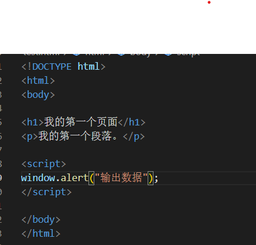
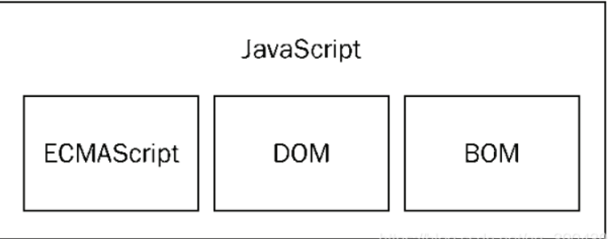
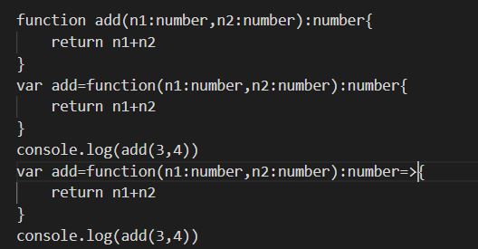

# JavaScript&TypeScript 学习总结
## 》JavaScript
### 1、javaScript的概念:是一种表述语言，也是一种基于对象(Object)和事件驱动(EventDriven)的，安全性好的脚本语言，运行在客户端，从而减轻服务器端的负担，总结如下：

  1.javaScript主要用来向HTML页面找那个添加交互行为。

  2.javaScript是一种脚本语言，语法和java类似。

  3.javaScript一般用来编写客户端脚本。

  4.javaScript是一种解释性语言，边执行边解释。

### 2、javaScript由核心语法ECMAScript、浏览器对象模型(BOM) 主要用于管理窗口与窗口之间的通讯，因此其核心对象是window、文档对象模型(DOM)三部分组成.

### 3、网页中引入javaScript三种方式:

  1.使用标签内部样式

  2.使用外部js文件

  3.直接在HTML标签中的行内样式。

### 4.javaScript的作用

1.实现页面表单验证

2.实现页面交互特效

### 5.javaScript的特点

  1.被设计用来向Html页面添加交互行为

  2.是一种英特网上最流行的脚本语言

  3.一般用于编写客户端脚本

  4．是一种解释性语言

  ### 6.JavaScript 显示数据
JavaScript 可以通过不同的方式来输出数据：

使用 window.alert() 弹出警告框。
使用 document.write() 方法将内容写到 HTML 文档中。
使用 innerHTML 写入到 HTML 元素。
使用 console.log() 写入到浏览器的控制台。
使用 document.getElementById(id) 从 JavaScript 访问某个 HTML 元素

### 7.JavaScript的组成

BOM - 浏览器对象模型
一套操作浏览器功能的API

通过BOM可以操作浏览器窗口，比如：弹出框、控制浏览器跳转、获取分辨率等

DOM - 文档对象模型
一套操作页面元素的API

DOM可以把HTML看做是文档树，通过DOM提供的API可以对树上的节点进行操作

### 8.JavaScript的数据类型
number
string
Boolean
undefined
null
object

### 9.
1.console.log调试程序 
2.条件结构 
if 
if...else 
if...else if...else 
当通过判断返回某个值时，优先使用三元表达式 
当通过判断执行n段逻辑代码时，只能用条件结构

## 》TypeScript
### 1. ts 对于js最大的变化就在于增加了 静态类型、类、模块、接口、类型注解
1.在 TypeScript 中，我们使用接口（Interfaces）来定义对象的类型。赋值的时候，变量的形状必须和接口的形状保持一致。

### 2.函数的定义方法
1.函数声明法：function+函数名
2.函数表达式法
3.箭头函数

### 3.接口（interface）
1.写一个类实现某个接口：类名 implements 接口名 
#### 2. 接口声明属性

interface IStudent {
    name: string;
    age: number;
}
 
class Student {
 
    constructor(public iStudeng: IStudent) {
    }
 
}
 
var s1 = new Student({name:"zhangsan",age: 30})
　

#### 3. 接口声明方法

interface IStudent {
    say();
}
 
class Student implements IStudent {
    say() {
        console.log("i am saying");
     }
}
 
class HightStudent implements IStudent {
    say() {
        console.log("high school i am saying");
     }
}
 
var s1 = new Student()
　　继承接口的类要实现接口中的方法，如上面的say方法
### 4.类
#### 1.类写法：class+类名
#### 2.继承 extends
语法：class+类名+extends+继承名 
子类会继承父类里面所有的属性和方法，私有（前面带有private）的除外。因此作为子类的实例除了可以调用自己的方法，也可以调用父类的方法。